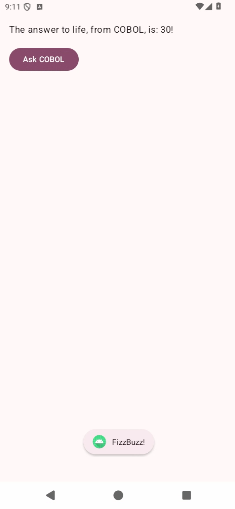
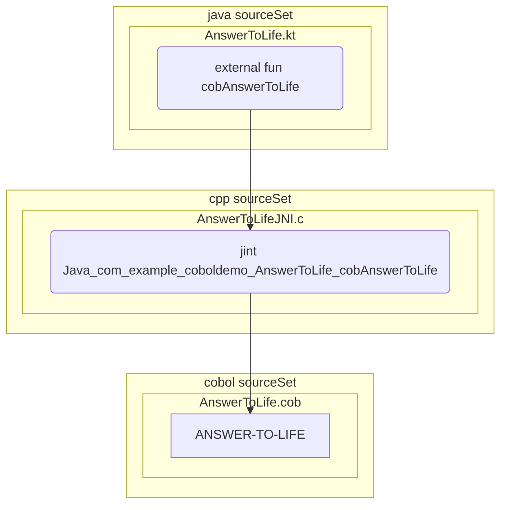
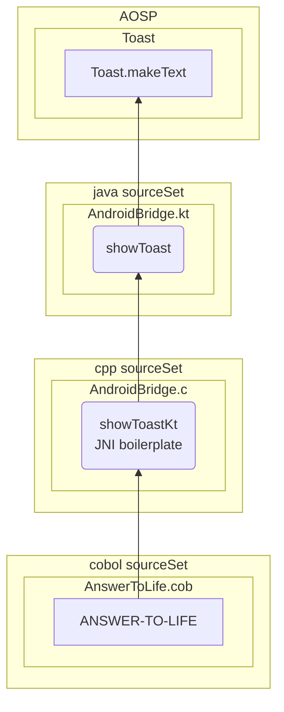
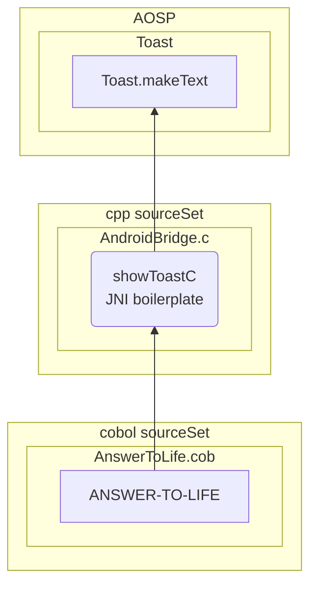
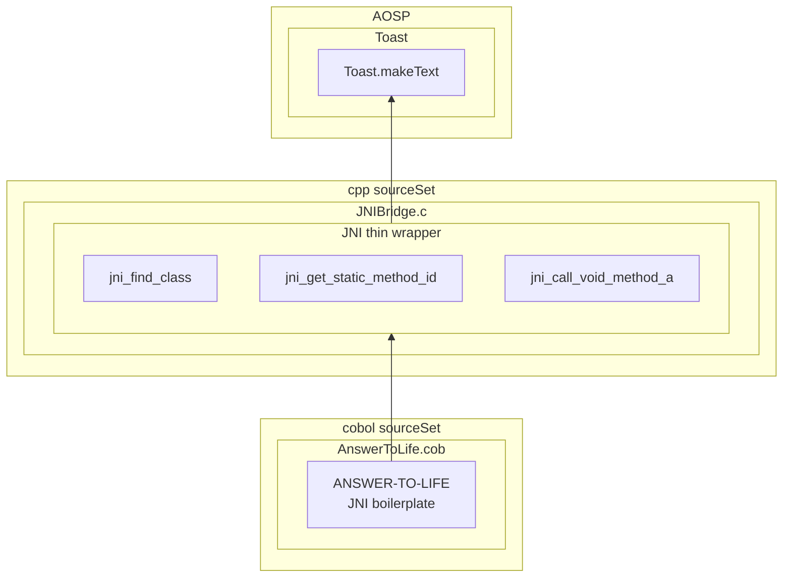

# Cobol Mobile Android app demo

This project demonstrates how to communicate between
COBOL and the Java/Kotlin layer of an Android application.

Everything is in one screen.

The screen has a button. Clicking on it will make a random
number between 0 and 42 appear. This is done by Kotlin code calling
a COBOL procedure (via a JNI/C intermediary).

Then, depending on the number, a Toast will appear. This is done by
COBOL calling out to AOSP's `Toast.makeText` api. A few variants of
this communication direction are demonstrated:

| Number Divisible by  | Toast text | Demonstrates                                                                   |
|---|---|---|
| 3 and 5 | FizzBuzz!  | Calling app Kotlin from COBOL                                                  |
| 3       | Fizz!      | Calling Android framework from COBOL,  with JNI boilerplate in a C function |
| 5       | Buzz!      | Calling Android framework from COBOL,  with JNI boilerplate in COBOL        |

## Calling COBOL from Kotlin

## Calling AOSP from COBOL
### Most logic in Kotlin

### Most logic in C

### Most logic in COBOL

