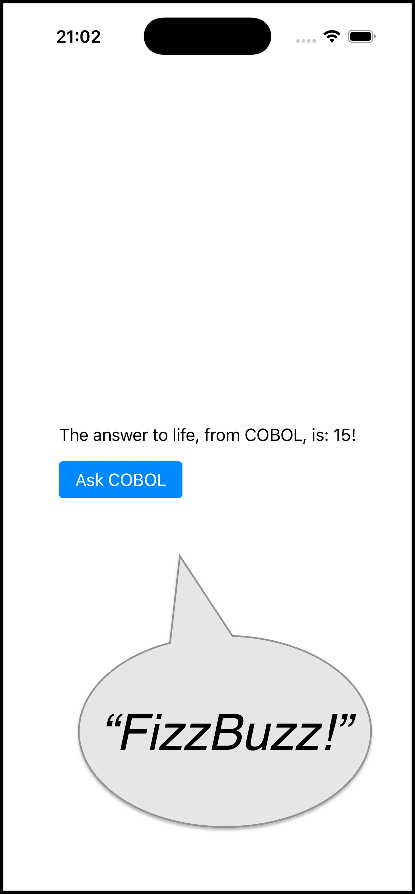
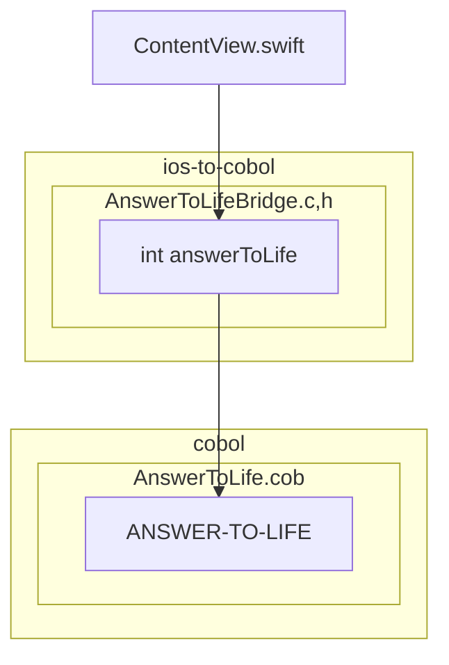
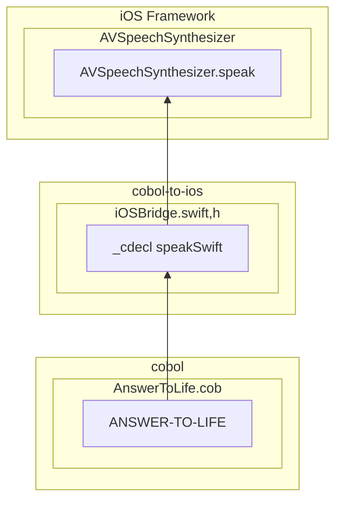
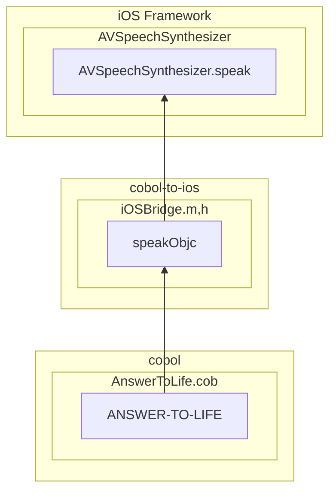
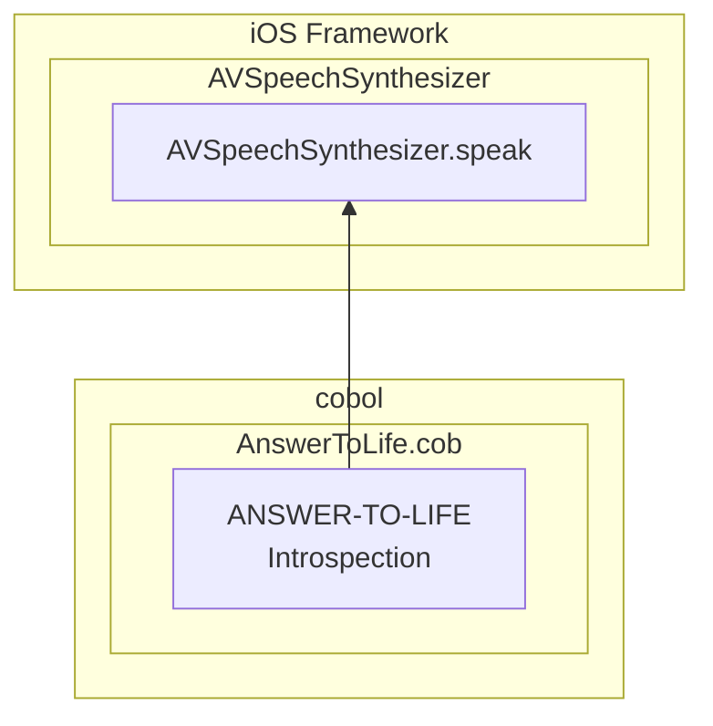

# Cobol Mobile iOS app demo

This project demonstrates how to communicate between
COBOL and the Swift/Objective-C layer of an iOS application.

Everything is in one screen.

The screen has a button. Clicking on it will make a random
number between 0 and 42 appear. This is done by Swift code calling
a COBOL procedure. 

Then, depending on the number, a text may be spoken by the speech synthesizer. This is done by
COBOL calling out to the AVFAudio framework's speech synthesizer apis. A few variants of
this communication direction are demonstrated:

| Number Divisible by  | Spoken text | Demonstrates                                                                   |
|---|---|---|
| 3 and 5 | FizzBuzz! | Calling app Swift from COBOL |
| 3       | Fizz!      | Calling app Objective-C from COBOL |
| 5       | Buzz!      | Calling framework APIs from COBOL, using introspection |

## Calling COBOL from Swift

## Calling the iOS framework from COBOL
### Most logic in Swift

### Most logic in Objective-C

### Most logic in COBOL

## XCode setup
See [doc/xcode-setup.md](doc/xcode-setup.md) for some tips on building with COBOL in Xcode.