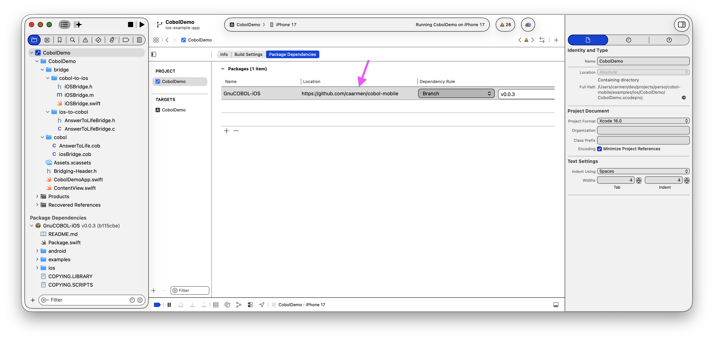
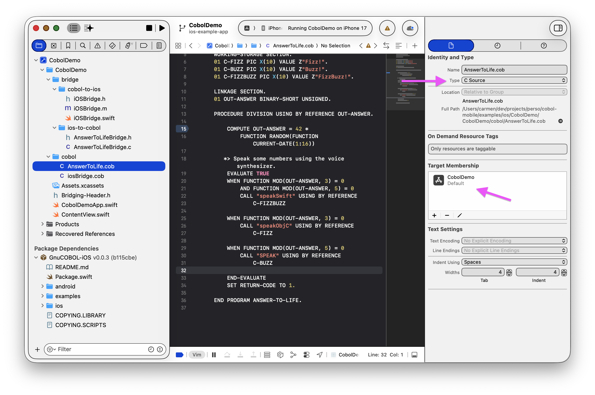
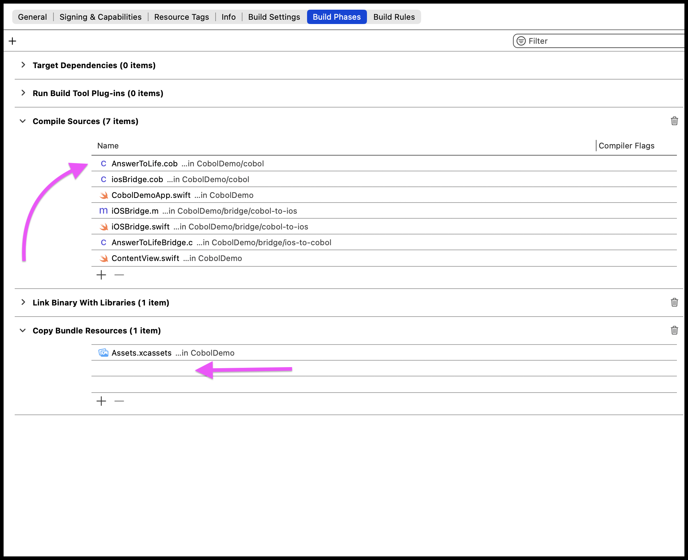
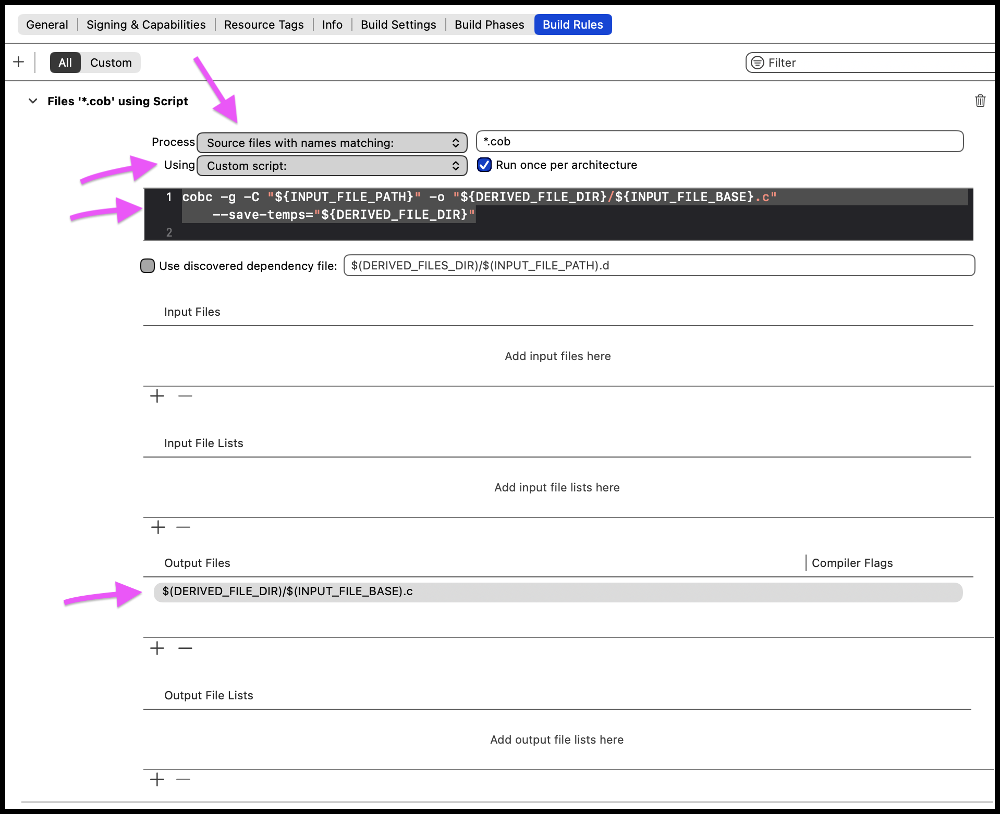
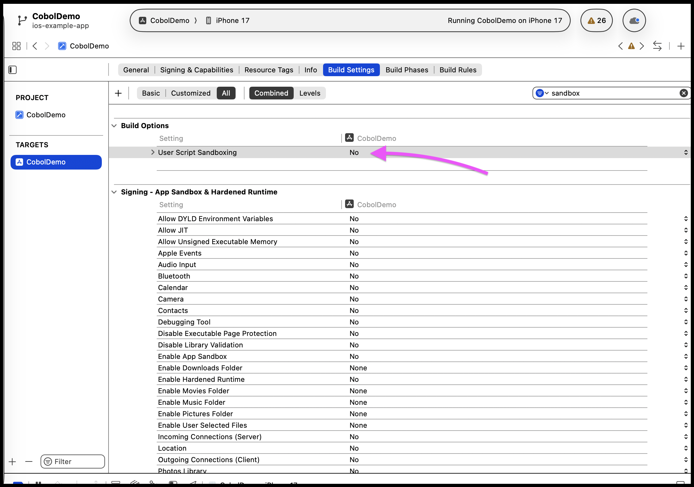
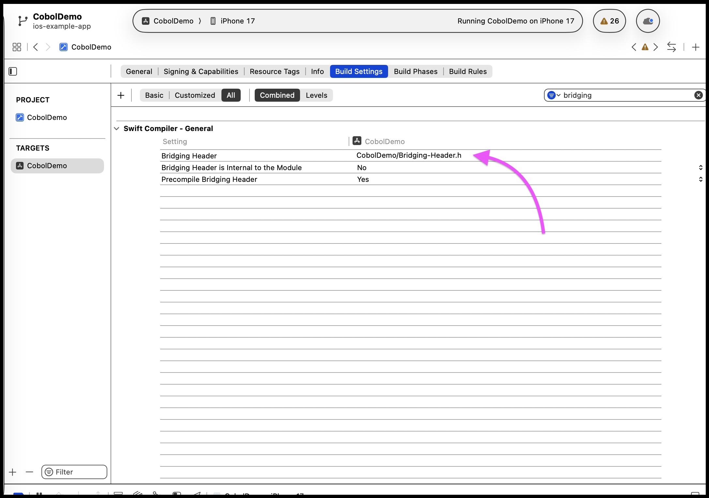

# Xcode setup for COBOL

Add this repository as a dependency: `https://github.com/caarmen/cobol-mobile`.

When adding a COBOL source file to your project:
* In the left pane, in the project tree, select the file. In the right pane:
  - Set the type to "C Source".
  - In "Target Membership", make sure your application's target is selected.
  

Set up the build:
* In the left pane, in the project tree, select the project.
* In the right pane, select "Build Phases".
  - Add your COBOL file to "Compile sources".
  - Remove your COBOL file from "Copy Bundle Resources".
  
* Select "Build Rules".
  - Create a new build rule.
  - For "Source files with name matching:", put `*.cob`.
  - For "Custom script", put `cobc -g -C "${INPUT_FILE_PATH}" -o "${DERIVED_FILE_DIR}/${INPUT_FILE_BASE}.c" --save-temps="${DERIVED_FILE_DIR}"`
  - For "Output files", put `$(DERIVED_FILE_DIR)/$(INPUT_FILE_BASE).c`
  - Note! Variables like `DERIVED_FILE_DIR` are surrounded by braces (`${DERIVED_FILE_DIR}`) in the "Custom script", but by parentheses (`$(DERIVED_FILE_DIR)`) in "Output files".
  - Don't check "Use discovered dependency file".
  
* Select the target, then select "Build settings".
  - In "Build options", search for "User Script Sandboxing".
    - Set this to "No". If you don't do this, the custom script in the run phase will fail to write to the derived file directory.
    
  - In "Linking - General", search for "Other Linker Flags".
    - Add `-lxml2`
  - In "Swift Compiler - General", search for "Bridging Header".
    - Set the file to your `Bridging-Header.h` file. See the example project for an example of this file.
    