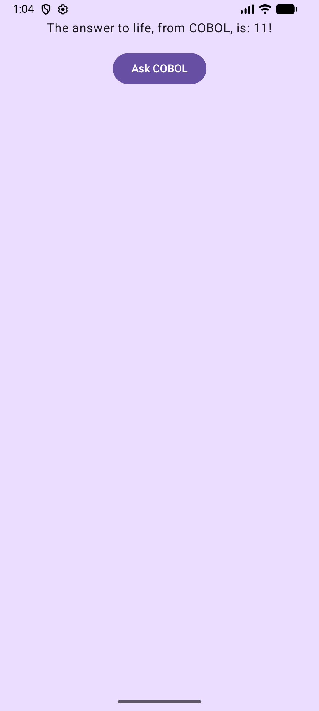
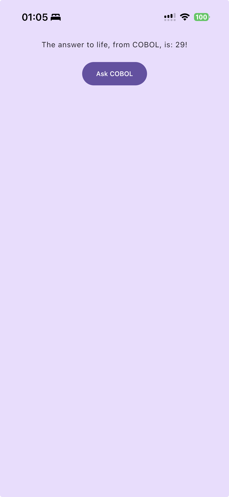
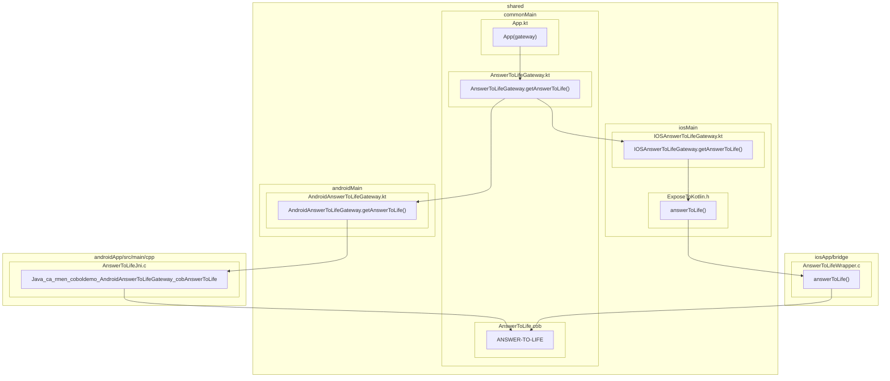

# Cobol Mobile Kotlin multiplatform app demo

This project demonstrates how to communicate from kotlin to COBOL in a Kotlin multiplatform application,
targeting Android and iOS.

This example uses the [kmp library](../../../kmp/).

## Demo

Everything is in one screen. This example is built on top of
a [Kotlin multiplatform template](https://kmp.jetbrains.com/templates/).

The screen has a button. Clicking on it will make a random number between 0 and 42 appear.

This is done by Kotlin code calling a COBOL procedure (via a JNI/C intermediary on Android, and c-interop on Kotlin).

| Android                                                           | iOS                                                       |
|-------------------------------------------------------------------|-----------------------------------------------------------|
|  |  |

## Architecture

The UI is shared between Android and iOS.

A "gateway" interface to call the COBOL prodedure is defined, and implemented
by Android (using JNI) and iOS (using c-interop).

The "gateway" implementation is injected into the `App` composable from each application's entry point:
* Android: `MainActivity`.
* iOS: `MainViewController`.

This example is as simple as possible. In a real app (really? a real mobile app with COBOL?), you
would likely:
* Provide the gateway implementation using a dependency injection framework.
* Have a viewmodel, and a use case, so the UI wouldn't directly be calling the "gateway" into COBOL.

