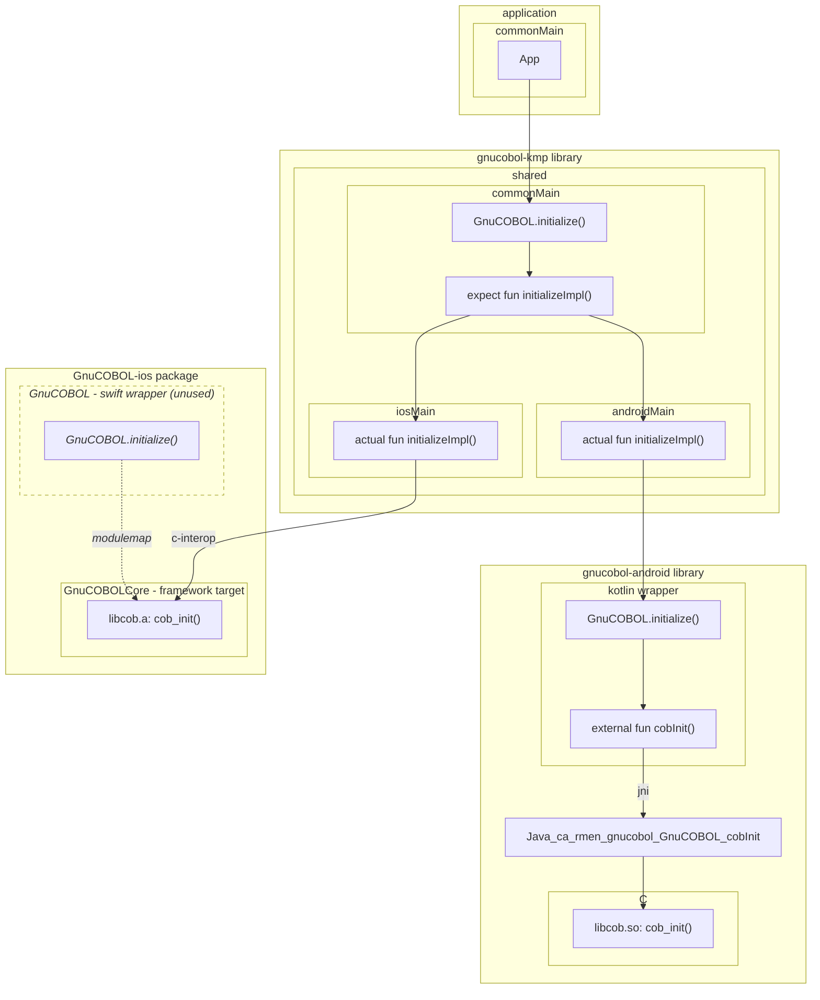
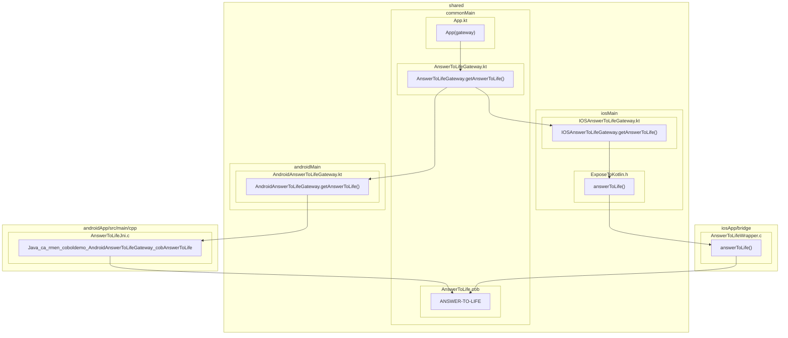

# Cobol Mobile Kotlin multiplatform app demo

This project demonstrates how to communicate from kotlin to COBOL in a Kotlin multiplatform application,
targeting Android and iOS.

This example uses the [kmp library](../../../kmp/).

## Demo

Everything is in one screen. This example is built on top of
a [Kotlin multiplatform template](https://kmp.jetbrains.com/templates/).

The screen has a button. Clicking on it will make a random number between 0 and 42 appear.

This is done by Kotlin code calling a COBOL procedure (via a JNI/C intermediary on Android, and c-interop on Kotlin).

| Android                                                           | iOS                                                       |
|-------------------------------------------------------------------|-----------------------------------------------------------|
|  |  |

## Architecture

The UI is shared between Android and iOS.

A "gateway" interface to call the COBOL prodedure is defined, and implemented
by Android (using JNI) and iOS (using c-interop). The different implementations are implemented using expect/actual.

This example is as simple as possible. In a real app (really? a real mobile app with COBOL?), you
would likely have a viewmodel, and a use case, so the UI wouldn't directly be calling the "gateway" into COBOL.

### Initialization

Before running the `ANSWER-TO-LIFE` procedure, the GnuCOBOL runtime must be initialized. Specifically, the `cob_init` function defined in the GnuCOBOL runtime must be called.

In this KMP application, we use a kotlin API `GnuCOBOL.initialize()` exposed by the KMP library.

The implementation of `GnuCOBOL.initialize()` depends on the platform:
- For Android, it calls into the gnucobol-android library, which calls through to `cob_init` via a JNI layer.
- For iOS, it calls into `cob_init` function exposed by the GnuCOBOL-ios package. The swift layer isn't used by the KMP library. Direct calls from Kotlin to Swift aren't currently possible. An additional Objective-C layer would be required. Instead, the KMP library directly accesses the `cob_init` C function via c-interop. The swift layer is relevant for an iOS app not using kotlin multiplatform. See the [ios example](../../ios/CobolDemo).

### ANSWER-TO-LIFE application procedure

